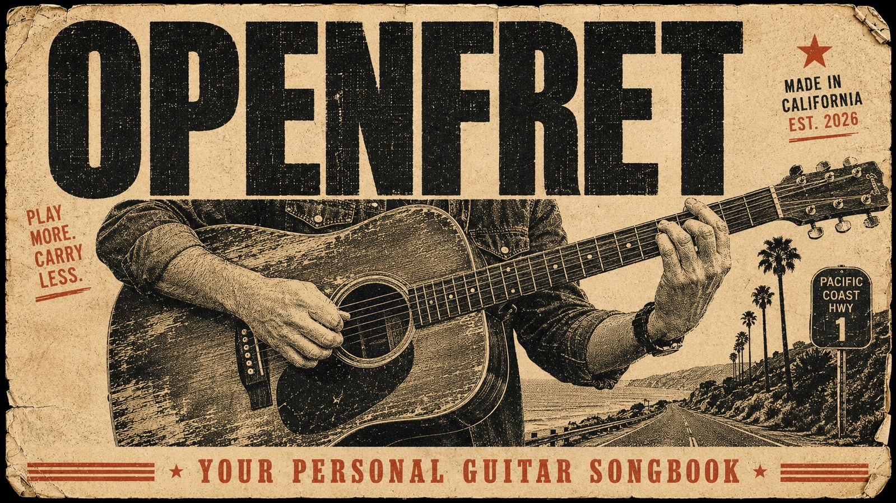
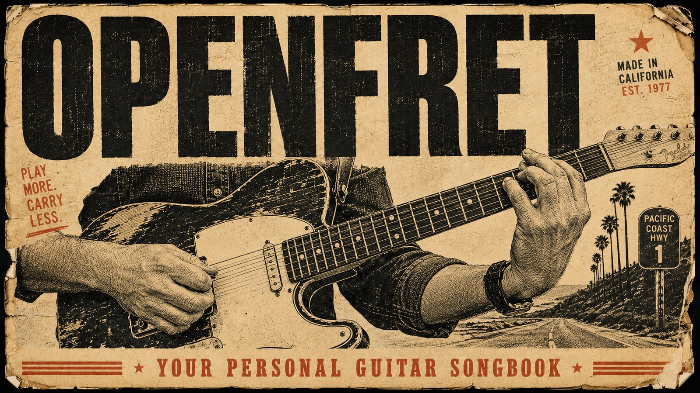
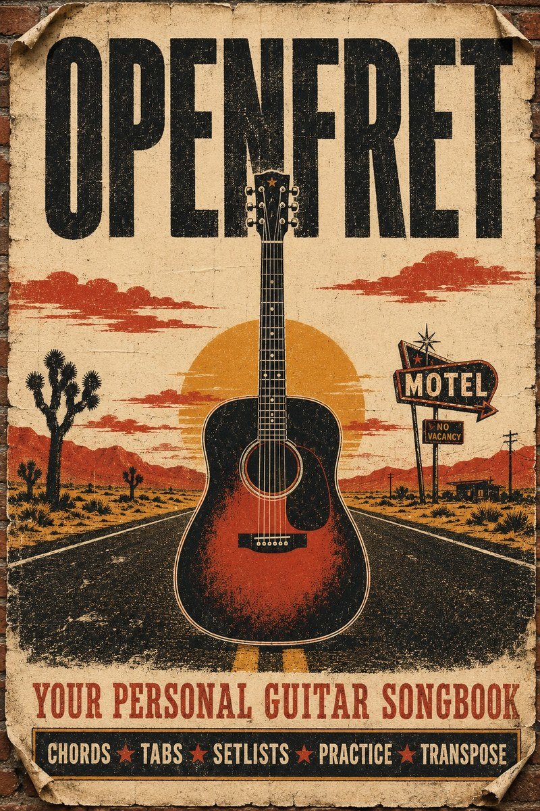

<p align="center">
  
</p>

# OpenFret

**Your guitar. Your songs. Your phone. No accounts. No ads. No monthly fee.**

[**→ Try the live demo**](https://awerb.github.io/openfret/) · [**Star on GitHub**](https://github.com/awerb/openfret)

OpenFret is a free, open-source guitar songbook that lives in your browser. Add your own chord sheets through a simple form, then pull them up on any device when you need them. A microphone tuner, metronome, scales reference, chord chart, and practice tools come built in.

It's for the player with a notebook full of songs they keep forgetting the chords to. The one who doesn't want to scroll past ads to read a chord sheet they wrote themselves. The campfire strummer, the open-mic regular, the basement jammer, the couch noodler. The person who thinks their songbook should belong to them, not a website.

## What you get

- **A real songbook.** Search, large-text reading mode, and auto-scroll for hands-free playing through long verses.
- **Bring your own songs.** Add, edit, and delete chord sheets through a simple form. No file editing. No coding.
- **Backup in one click.** Export your whole library as a single JSON file. Import it on another device to sync.
- **10 sample songs to start.** Verified public-domain folk, blues, jazz, and rock-style arrangements so the app feels alive on first run. Hide them anytime.
- **Microphone tuner.** Pitch detection with cents accuracy and a steady "in tune" indicator that holds when you nail it.
- **Reference notes** for all six strings (E A D G B E), tappable while you tune.
- **Metronome** with tap tempo, presets from ballad to very fast, and 2/4 / 3/4 / 4/4 / 6/8.
- **Pentatonic scales reference** with all five fretboard patterns.
- **Chord chart** covering major, minor, 7th, sharp/flat, extended, and power chords.
- **Practice tab** with a backing track player, fretboard note quiz, and interval ear training.
- **Works offline-first.** Once the page is loaded, no network needed. Your songs live in your browser, never on a server.

## Add your first song in 30 seconds

1. Open OpenFret.
2. Tap **+ Add Song** in the header.
3. Type the title, artist, chords summary, and the lyrics. Wrap each chord in square brackets right before the syllable it falls on:
   ```
   [G]Heading [D]down south to the [Em]land of the [C]pines
   ```
4. Save. Your song appears at the top of the list, right next to the samples.

To back your songs up or move them to another device, open **Library → Export to file**. To restore, **Library → Import & Merge**.

## Sample songs

OpenFret ships with 10 verified public-domain songs across folk, blues, jazz, and rock-style arrangements. Each entry includes a `license` field with the source attribution.

| Title | Artist | Genre | License |
|---|---|---|---|
| Amazing Grace | John Newton (Traditional) | Folk | PD lyrics 1779 |
| House of the Rising Sun | Traditional | Folk / Rock arrangement | PD traditional |
| Scarborough Fair | Traditional English | Folk | PD 16th century |
| Auld Lang Syne | Robert Burns | Folk | PD 1788 |
| Oh! Susanna | Stephen Foster | Folk | PD 1848 |
| St. Louis Blues | W.C. Handy | Blues | PD 1914 |
| St. James Infirmary | Traditional | Blues | PD 1928 |
| Nobody Knows You When You're Down and Out | Jimmy Cox | Blues | PD 1923 |
| When the Saints Go Marching In | Traditional | Jazz | PD spiritual |
| Sweet Georgia Brown | Bernie, Pinkard & Casey | Jazz | PD 1925 |

If you'd rather start with a clean slate, open **Library → Hide Sample Songs** at any time. Your own songs are unaffected.

## Privacy

Your songs never leave your device. There is no server, no telemetry, no third-party scripts, and no cookies. The only network requests are for the page assets themselves, served once when you load the page.

## Host it yourself

The whole app is plain HTML, CSS, and JavaScript. No build step. No npm install. Pick the path that fits you:

**GitHub Pages (recommended, about 1 minute).** Fork this repo. In your fork go to **Settings → Pages → Source: GitHub Actions**. The included workflow auto-publishes your songbook at `https://YOUR-USERNAME.github.io/openfret/` and redeploys on every push.

**Locally.** Clone the repo and open `index.html` in your browser. For full microphone support, run `python3 -m http.server 8000` in the folder and visit `http://localhost:8000/`.

<details>
<summary>Other hosting options</summary>

- **Netlify drag-and-drop**: visit [app.netlify.com/drop](https://app.netlify.com/drop), drag the project folder onto the page, you're live. The included `netlify.toml` handles config.
- **Vercel**: install the [Vercel CLI](https://vercel.com/docs/cli), run `vercel` inside the project folder. The included `vercel.json` handles config.
- **Any static host** (S3, Cloudflare Pages, Surge, your own VPS, a USB stick): just upload the files. There is nothing to compile.

</details>

<p align="center">
  
</p>

## Customize the look

- **Header image**: replace `assets/openfret-banner.jpg` with your own. The included assets folder also contains `openfret-banner-electric.jpg` and `openfret-poster.jpg` if you want a different vibe.
- **Title and tagline**: edit the `<title>` and `<h1>` in `index.html`.
- **Colors**: theme tokens live near the top of `styles/main.css`. The default is a high-contrast dark theme.
- **Tabs**: remove a tab by deleting its `<button class="nav-tab">` in `index.html` and the corresponding section.

<p align="center">
  
</p>

## Project layout

```
openfret/
├── index.html              app markup, modals, all UI structure
├── styles/main.css         app styles
├── data/sample-songs.js    bundled public-domain sample songs
├── js/
│   ├── library.js          localStorage CRUD + JSON import/export
│   ├── onboarding.js       welcome banner + help modal
│   └── app.js              main runtime (tuner, metronome, songbook, practice)
├── assets/                 header SVG, favicon
├── songs/                  optional drop-in JSON folder for power users
├── tests/                  smoke tests
├── .github/workflows/      GitHub Pages auto-deploy
├── netlify.toml            Netlify config
├── vercel.json             Vercel config
├── README.md
├── LICENSE                 MIT
├── CONTRIBUTING.md
├── CODE_OF_CONDUCT.md
└── CHANGELOG.md
```

## Roadmap

Planned, but not yet built:

- Song-level transposition (one click to shift the whole song up or down a key)
- Capo helper (pick a capo position, see chord shapes)
- Multi-device sync via a shareable URL with the song JSON encoded
- Print-friendly stylesheet
- PWA install with offline support
- Optional chord diagrams inline with the lyrics

PRs welcome. See [CONTRIBUTING.md](CONTRIBUTING.md).

## Browser support

Tested on the current versions of Chrome, Safari, Firefox, and Edge, on both desktop and mobile. The microphone tuner requires HTTPS or `localhost` per browser security rules. iOS Safari supports everything; the splash screen tap unlocks audio for the tuner and metronome.

## License

OpenFret is [MIT licensed](LICENSE). The bundled sample songs are individually marked as public domain in `data/sample-songs.js`.

## Credits

Forked from a personal songbook project by Adam Werbach. Made open-source so anyone can have a no-fuss, no-account guitar songbook of their own. If you ship a customized version, a link back to this repo is appreciated but not required.

## Showcase

Are you using OpenFret? Open a PR adding your deployment to this list.

- _Your songbook here._
